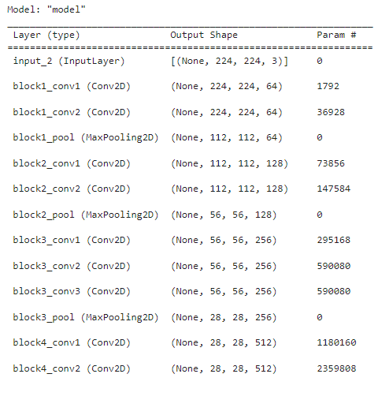
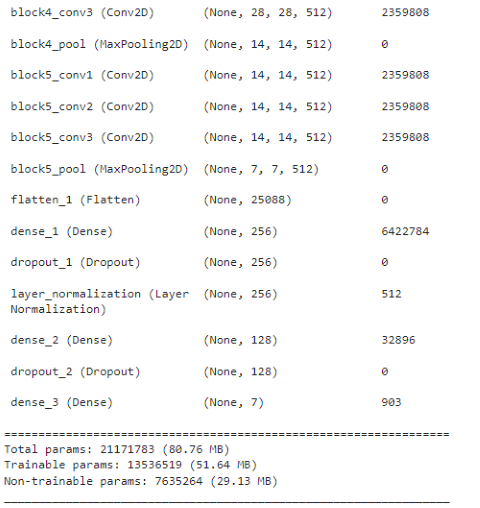
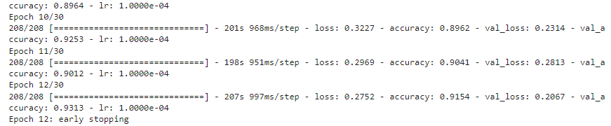
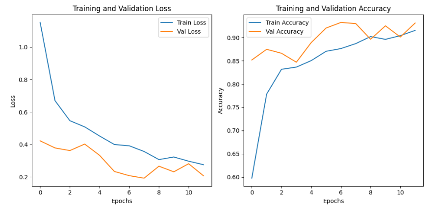
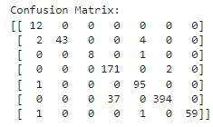

# LungXcan

LungXcan is an innovative application for early detection of lung diseases using X-ray images. By utilizing artificial intelligence and advanced medical image processing technology, LungXcan allows users to analyze lung X-ray images quickly and accurately. The app comes with automatic disease detection using AI algorithms trained to recognize conditions such as pneumonia, tuberculosis, lung cancer and more. Users can upload live X-ray images to get instant interpretation, with a high degree of accuracy and reliability in diagnosis. The user-friendly interface makes the app suitable for use by medical professionals, public health services, and the general public. With the aim of improving accessibility and efficiency in the diagnosis and management of lung diseases.

### Tools

This research was conducted using Google Collab. Python language for programming and using tensorflow to create the model. We used CNN to build the lung disease classification model.

### Dataset
We collected data from kaggle and roboflow platforms. This dataset consists of 7 classes and is divided into 3 :
- Training Set (6645 images)
- Validation Set (830 images)
- Testing Set (830 images)

## Model
### Architecture

### Training Result

We use early stop and learning rate to prevent model overfitting.
The model achieved a training accuracy of 91.54% and validation accuracy of 93.13%.

Here is a plot of Train vs Val Loss and Train vs Val Accuracy.

## Confussion Matrix
This is the prediction result of the testing dataset.

